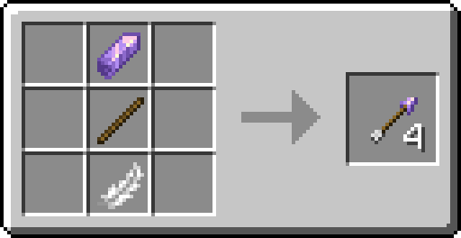
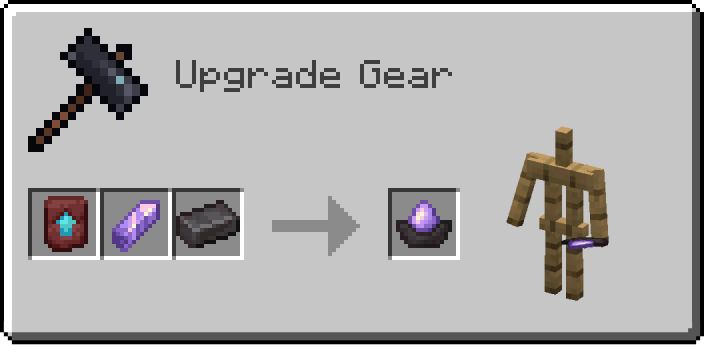

# Amethyst Update
Amethyst Update is a Fabric mod which provides new opportunities for using amethyst shards in both simple and exciting ways. With it, you'll have more reasons to keep these precious crystals in your inventory when it's packed with mined ores. This little mod also tries to fit into the vanilla style. Below, you will find a detailed guide, but you can also try to explore it yourself!

## Amethyst Arrow
Have you ever had such a problem, that you have plenty of amethyst shards in your inventory after finding an amethyst geode? What to do with them if you are not going to decorate your house with tinted glass? Will you just throw them out?

*Amethyst Arrows* provide a compelling incentive to mine amethyst shards! It's a new type of arrows you can craft in Minecraft.

*Amethyst Arrows* deal a little bit less physical damage, but apply a new status effect called *Bleeding* when hit (shards are sharp!).

>### Bleeding Effect 
>
>
>| Level | Damage per 20 ticks/1 second |
>| ------ | ------ |
>| 1 | ()x1.25 |
>| 2 | ()x1.5 |
>| 3 |()x1.75 |
>| 4+ |()x1.25 + ()x0.25*(level - 1) |
>
>*Bleeding* effect bypasses armor and even can kill you. Be careful! Wither, Stray, Skeleton, Wither Skeleton, Skeleton Horse and all golems are invulnerable to this effect.

The level of the effect depends on the velocity of the arrow when it hits a mob:

- level 1: if the second level wasn't applied
- level 2: can be applied if an amethyst arrow was launched from a fully charged bow/crossbow
- level 3: has a 25% chance to be applied instead of the second level

## Bleeding Potion
Once you’ve got a brewing stand, a new *Bleeding Potion* is available to you. To brew it, you need a new item called *Amethyst Dust* and an Awkward Potion.

| Potion | Base | Reagent | Effect |
| :------: | :------: | :------: | :--- |
| *Bleeding Potion*| *Awkward Potion*| *Amethyst Dust*| Applies *Bleeding Effect* for 20 seconds.  **Long:** 30 seconds.  **Enhanced:** Bleeding II for 20 seconds.

Splash and Lingering potions are also available.

## Ancient Staff
Earlier I said that you can use amethyst shards in both simple and exciting ways. Here is a weapon for real Minecraft adventurers! *Ancient Staff* is a powerful support weapon with its own unique mechanics. To obtain it, you need to explore the depth of Minecraft!

### Reinforced Amethyst
To craft the *Ancient Staff*, you need to find/craft its parts. And one of them is a *Reinforced Amethyst*. You need to make a loooong way down to get it (savvy?).

### Mysterious Stick
These are old pieces of broken staffs that were made long ago. Now they are gathering dust in chests of pillagers or laying in bags of wandering traders, waiting for something to happen...

- a 20% spawn chance in chests in pillager outposts
- a 10% spawn chance in chests in woodland mansions
- can be sold by wandering trader

Phew, now, when you have all necessary parts, you can finally craft the *Ancient Staff*!

### Staff Enchantments / Effects

But wait... Looks like it doesn’t work. As you are not a sorcerer, you need to enchant the staff in order to use it. Since it is an old and powerful weapon, you must have at least ***15 bookshelves*** to enchant it. And here is where magic begins...

*Ancient Staff's* behaviour depends on its main enchantment. Currently there are 2 different main encahntments: *Tempered* and *Shattered*.

> #### Tempered Enchantment
>
>When the staff is used, applies a *Tempered* effect for ***5 minutes*** on the user. On the second level of the enchantment the duration increaces to ***8 minutes***.
> 
> 
>
>When you are under the *Tempered* effect, all damage taken is reduced by ***2 times*** and everyone who hits you in close combat gets *Bleeding*. On the second level of the effect the damage is reduced by ***2.5 times***, each melee attacker gets *Bleeding II*.

> #### Shattered Enchantment
>
>When the staff is used, applies a *Shattered* effect for ***5 minutes*** on each living entity within ***64 blocks*** except for the user. On the second level of the enchantment applies *Shattered II* for ***8 minutes*** within ***96 blocks***. Everyone additionally gets *Bleeding* for a short period of time on the first level of the enchantment and *Bleeding II* on the second level.
> 
> 
>
>When you are under the *Shattered* effect, all damage taken is multiplied by ***2 times***. On the second level of the effect, the damage is multiplied by ***2.5 times***.

*Shattered* and *Tempered* enchantments are ***incompatible***, just like their effects. If entity has, for instance, a *Shattered* effect, and a *Tempered* effect is applied, the *Tempered* will remove the *Shattered*, but its own duration will be ***halved*** and vice versa.

### Additional information

*Ancient Staff* has a ***6-minute cooldown*** between uses. It can additionally have an Unbreaking Enchantment, but not Mending. *Ancient Staff* and all of its parts are ***fireproof***.

Thus, when you get your first netherite ingot, it’s up to you whether you'll make a netherite tool/armor or try to create something more powerful. As you can see, *Ancient Staff* is a support weapon which can be either an additional protection or a damage source. Both those who prefer melee and ranged attacks will find this weapon useful!

## Amethyst Lantern
Additionally, Amethyst Update also adds one new decoration. Just a cute lantern :3.

For now, that’s all what this mod can bring to Minecraft, but I’m planning to add a few more interesting features. Stay tuned!

*Requires Fabric API*
